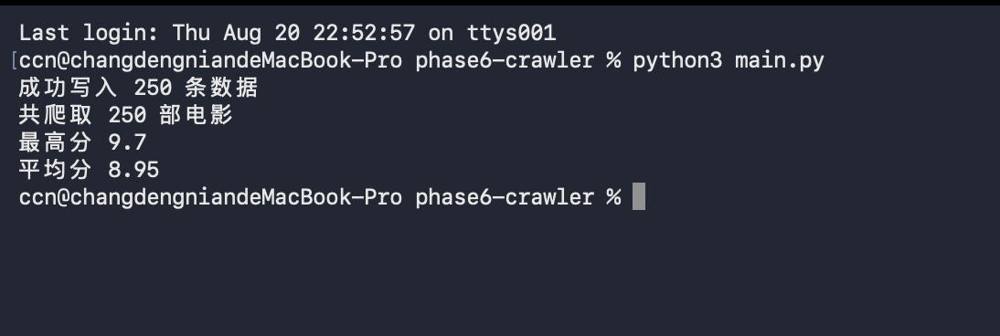
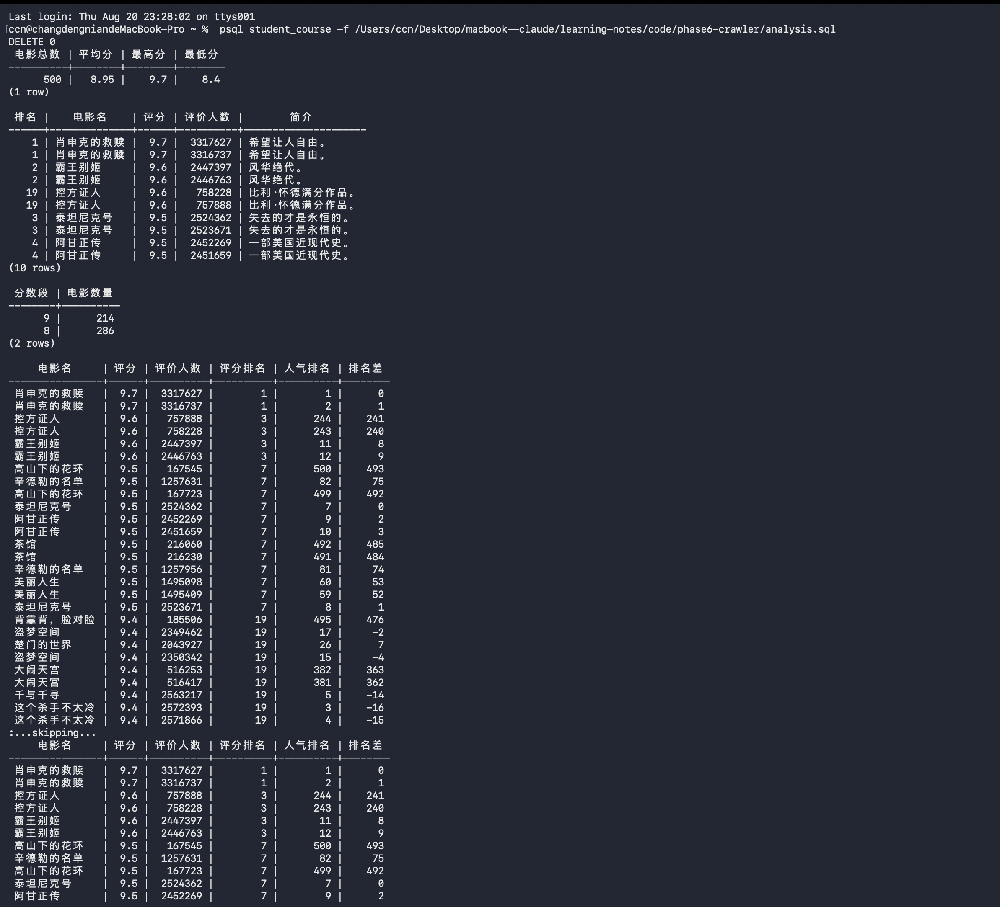

# 豆瓣电影 Top250 异步爬虫

> 基于 asyncio + aiohttp 的异步并发爬虫，爬取豆瓣电影 Top250 全量数据，写入 PostgreSQL 并用 SQL 窗口函数做数据分析。

## 功能

- [x] 异步并发爬取豆瓣 Top250（10 页 × 25 部 = 250 部）
- [x] Semaphore 限速（同时最多 3 请求，防止封 IP）
- [x] 失败自动重试（状态码异常 + 网络异常双重试，最多 3 次）
- [x] BeautifulSoup 解析，数据清洗（评价人数、简介等字段规整）
- [x] asyncpg 批量写入 PostgreSQL（executemany，一次网络往返）
- [x] SQL 数据分析：评分分布、窗口函数排名对比、Top10 重合分析

## 数据成果

| 指标 | 值 |
|------|------|
| 爬取电影数 | 250 |
| 平均分 | 8.94 |
| 最高分 | 9.7（肖申克的救赎） |
| 口碑冷门之王 | 控方证人（评分第 2，人气第 122） |

## 技术栈

- Python 3.14 / asyncio / aiohttp
- BeautifulSoup 4
- asyncpg / PostgreSQL 18
- 无 Pydantic 依赖（模型验证见 task1_models.py）

## 文件结构

```
├── main.py             # 入口：爬取 → 解析 → 入库 → 统计
├── analysis.sql        # 5 条数据分析 SQL（含窗口函数）
├── task1_models.py     # Pydantic 数据模型
├── task2_fetch_one.py  # 单页抓取 + 解析（含豆瓣新结构适配）
├── task3_concurrent.py # 并发抓取 + Semaphore
├── task4_save_db.py    # asyncpg 批量写入
└── task5_retry.py      # 重试机制
```

## 快速开始

```bash
pip install aiohttp asyncpg beautifulsoup4
# 先建表（psql 里执行）
# CREATE TABLE movies (id SERIAL PRIMARY KEY, rank INTEGER, title VARCHAR(200),
#                      score REAL, votes INTEGER, quote TEXT, url TEXT,
#                      created_at TIMESTAMP DEFAULT NOW());
python main.py
```

## 运行截图

### 爬虫运行



### SQL 数据分析


